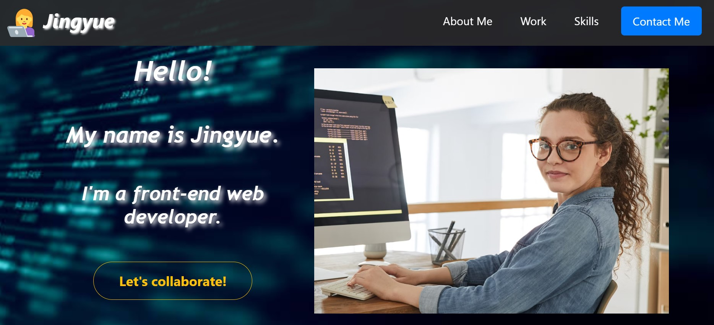
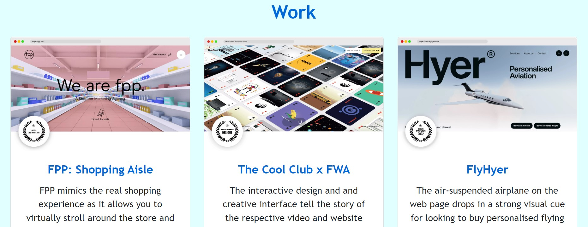
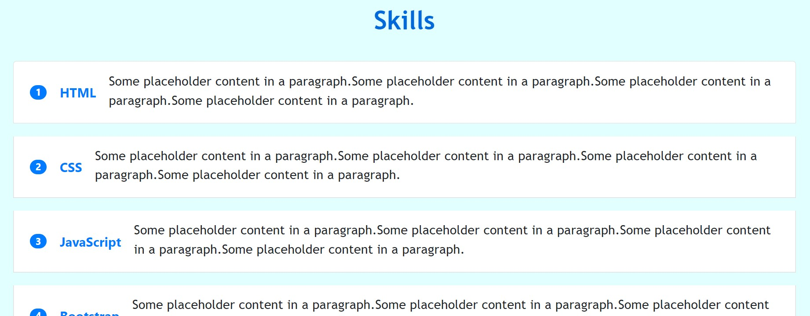
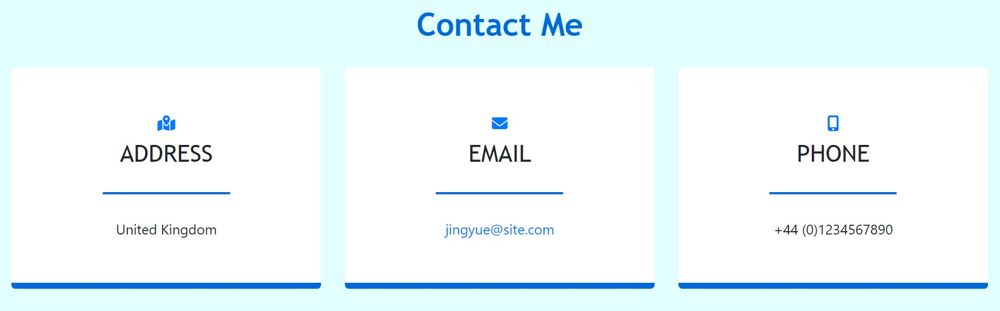
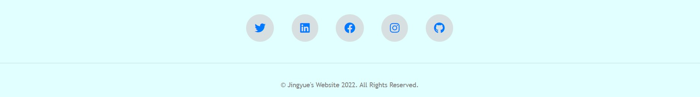

# 03 UX and Advanced CSS: Bootstrap Portfolio

## Description 

This project is to build a portfolio layout using the Bootstrap (v4) CSS Framework from scratch.  
 
A portfolio of work can showcase the web development skills and talents to potential employers. An effective portfolio highlights our strongest work as well as the thought processes behind it. A portfolio with deployed web applications is very helpful for our career search. 

Because I don't have any deployed working web applications to showcase at this point, I have used the images of several award-winning websites as placeholder for my future applications. I can change them to real applications as I create them later in the course.

This project needs to meet the critical requirements necessary to develop a portfolio that satisfies a typical hiring manager’s needs as shown below:

* A navigation menu at the top. Include links that are applicable to the portfolio. Links should navigate to the appropriate sections
* A hero section: A jumbotron featuring a picture, my name, and any other information I'd like to include
* A work section: A section displaying work in grid. Use Bootstrap cards for each project. Award-winning websites are used as placeholders, with a brief overview of the work. Each project will eventually link to my class project work
* A skills section: List out the skills expected to learn from the bootcamp
* A contact section: a section in the same row
* A footer section: All hyperlinks should have a hover effect. All buttons should display a box shadow upon hover

## Installation
The link to my portfolio page:
https://dr-jingyuezhao.github.io/Bootstrap-Portfolio/

## Usage 

* On the top of the page, it presents my name, and navigations to each section on the page.  
* Click one of the links in the navigation, the UI scrolls to the corresponding section: "About Me", "Work", "Skills", "Contact Me"
* The "About Me" section is a short summary of my professional achievements 
* The "Work" section contains titled images of some web applications
* The "Skills" section lists out the skills expected to learn from the bootcamp
* The "Contact Me" section contains the information about how to contact me in different ways

Website demo

The following images shows the portfolio's appearance:  

## Credits

Resources:
* How to create a portfolio: https://www.w3schools.com/howto/howto_website_create_portfolio.asp
* How to build a freelance portfolio website: https://www.forbes.com/uk/advisor/business/software/how-to-build-a-freelance-portfolio-website/
* How to use bootstrap 4: https://getbootstrap.com/docs/4.0/getting-started/introduction/
* How to use fontawesome icons: https://fontawesome.com/icons

## License

MIT License

Copyright (c) 2022 Jasmine

Permission is hereby granted, free of charge, to any person obtaining a copy
of this software and associated documentation files (the "Software"), to deal
in the Software without restriction, including without limitation the rights
to use, copy, modify, merge, publish, distribute, sublicense, and/or sell
copies of the Software, and to permit persons to whom the Software is
furnished to do so, subject to the following conditions:

The above copyright notice and this permission notice shall be included in all
copies or substantial portions of the Software.

THE SOFTWARE IS PROVIDED "AS IS", WITHOUT WARRANTY OF ANY KIND, EXPRESS OR
IMPLIED, INCLUDING BUT NOT LIMITED TO THE WARRANTIES OF MERCHANTABILITY,
FITNESS FOR A PARTICULAR PURPOSE AND NONINFRINGEMENT. IN NO EVENT SHALL THE
AUTHORS OR COPYRIGHT HOLDERS BE LIABLE FOR ANY CLAIM, DAMAGES OR OTHER
LIABILITY, WHETHER IN AN ACTION OF CONTRACT, TORT OR OTHERWISE, ARISING FROM,
OUT OF OR IN CONNECTION WITH THE SOFTWARE OR THE USE OR OTHER DEALINGS IN THE
SOFTWARE.